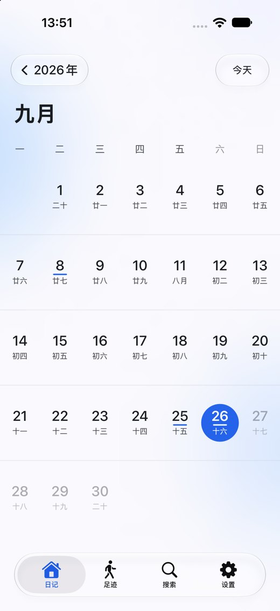
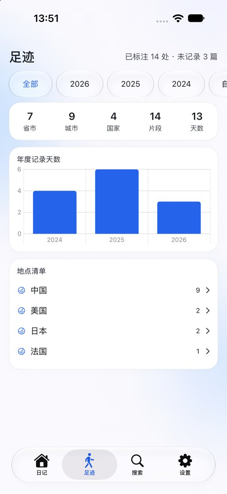
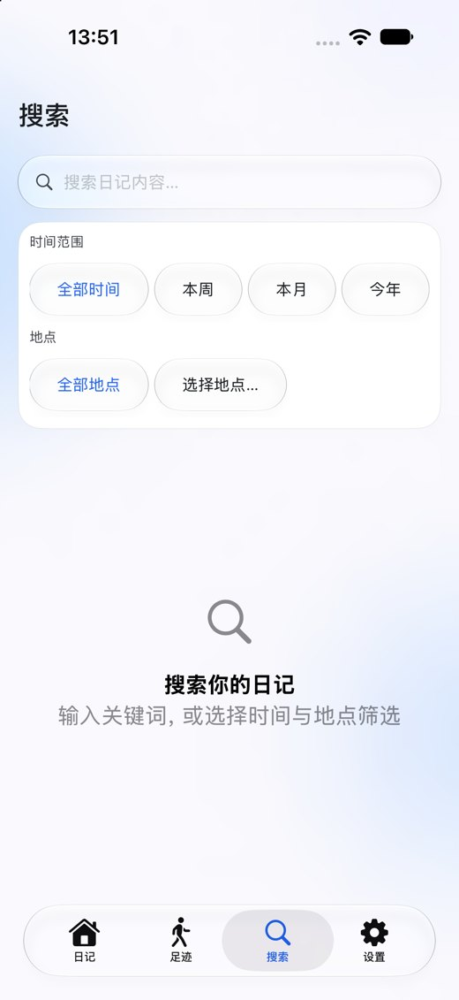
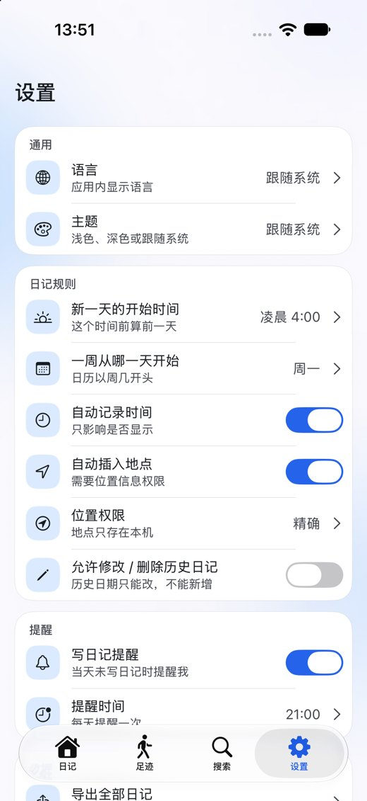

# 一页时光（JustADiary）

[](LICENSE)
[]()
[]()
[]()
[-7C3AED.svg)](#ai-参与与致谢)
[](#数据与隐私)

> **本项目由 AI 编写。** 代码、测试与文档都是在 AI（[DeepSeek](https://www.deepseek.com/)）
> 协助下完成的；特别感谢 DeepSeek。详见 [AI 参与与致谢](#ai-参与与致谢)。

一页时光是一款 **纯本地** 的 iOS 日记应用（iOS 27+ / SwiftUI）：月历与年历浏览、富文本日记、
足迹聚合、全文搜索。**零第三方依赖、不发起任何网络请求、不做统计上报**，数据只存在本机。

## 预览

| 月历 | 阅读 | 位置与引用 |
|:---:|:---:|:---:|
|  |  |  |

| 足迹 | 搜索 | 设置 |
|:---:|:---:|:---:|
|  |  |  |

> 截图取自模拟器 + `tools/seed_sample_diary.py` 生成的示例数据（非真实用户数据）。

## English summary

**一页时光 (JustADiary)** is a fully local iOS diary app: a month/year calendar home, a
rich-text diary editor (semantic paragraph styles, inline formats, images, automatic time
and location, todo lists), a footprint view that aggregates recorded places by country /
province / city, and full-text search (SQLite FTS5 with CJK segmentation).

- **Platform** — iOS 27+, iPhone only, SwiftUI, Swift 6.4, Xcode 27.
- **Dependencies** — none: no SPM packages, no network requests, no analytics. Everything
  stays on the device (SQLite database + local image store, zip-based backup import/export).
- **Design** — Apple's Liquid Glass is used on the control layer only; content cards keep the
  system grouped background. Design tokens, Dynamic Type handling, contrast and the editor's
  round-trip invariants are documented under [`docs/`](docs/).
- **Written by AI** — the code, tests and documentation were produced with AI assistance
  (DeepSeek); see [AI 参与与致谢](#ai-参与与致谢).
- **License** — MIT.

```bash
git clone https://github.com/SeanCSLegion/JustADiary.git
cd JustADiary
python3 generate_project.py     # 生成 JustDiary.xcodeproj
open JustDiary.xcodeproj        # ⌘R 运行，⌘U 测试
```

## 功能

- **首页日历**：月历/年历查看，支持镜头缩放切换动画、今日圆环/选中实心圆标识、日记日期圆点标注
- **日记编辑**：富文本编辑器，段落样式（大标题 / 小标题 / 正文 / 引用，字号取 Apple 的
  iOS 默认梯级 28 / 22 / 17 / 15 并跟随系统文字大小）与行内格式（粗体 / 斜体 / 删除线 /
  下划线 / 居中对齐 / 列表 / 待办），支持插入图片、自动记录时间与位置、「放弃修改」二次确认
  - 位置只在**新建片段**时获取一次：保存时若还没有位置会先确认（确认后该片段不再支持添加位置）；
    编辑已有片段不重新获取，只能调整显示精度，见 `docs/location-recording.md`
- **足迹**：按国家/省份/城市三级聚合已记录的地点（可展开清单）+ 年度记录天数趋势图，支持按年份与自定义时间范围筛选
- **搜索**：全文搜索（SQLite FTS5 + CJK 分词）+ 时间/地点筛选，关键词高亮
- **设置**：语言（中/英，即时生效）、主题（浅/深/跟随系统）、日记开始时间、周起始、自动定位、提醒、历史编辑、备份导入导出

## 设计

- 采用 iOS 26 引入、iOS 27 继续沿用的 **Liquid Glass** 设计语言，但**只在控件层使用**：`buttonStyle(.glass)` / `.glassProminent` 的按钮、芯片、搜索框与悬浮按钮
  - 按 WWDC26 session 8120 的建议，**内容区不使用 Liquid Glass**（下方没有可折射的内容，玻璃卡片会读作「浮在玻璃上的卡片」）。内容卡片统一走 `diaryCard(cornerRadius:)`：系统分组背景色 + 细描边 + 柔和阴影
  - 搜索框、编辑器格式栏、首页日期/返回胶囊、toast 都在控件层，走 `.glassEffect`；sheet 不覆盖 `presentationBackground`，用系统默认的新版玻璃外观
- 统一的设计令牌见 `Views/Components/DesignSystem.swift`：`Radius`（圆角，嵌套面用 `Radius.concentric(outer:inset:)`）、`Spacing`、`TypeSize`（字阶）
- 跟随系统显示设置：**动态字体**（每个设计字号按最接近的 Apple 文本样式经 `UIFontMetrics` 解析，并设上限以保证字阶不倒挂；日历 Canvas 文字单独半速缩放）、
  **减弱动态效果**（morph 退化为快速交叉淡入）、**增强对比度**（卡片描边加深）、浅色/深色
- 编辑器照 Apple 备忘录的做法管理字体：只给**语义段落样式**（大标题 28 / 小标题 22 / 正文 17 / 引用 15），
  > Android 版按 **Material 3** 取同一批语义样式的角色字号（28 / 22 / **16** / **14**）——
  > 两端的阅读排版**有意不同**，因为各按自己的平台规范。字号不落库、只存语义样式，
  > 所以 `.jdiary` 仍然双向互通（详见 `docs/design-system.md` §3.1 的平台分工表），
  字号由系统「文字大小」解析，不落任意磅值；块类型与字号解耦，改梯级不会改写已有日记
- 日期/时间格式按语义槽位统一（年 / 月 / 日+星期 / 区间 / 时刻），时刻跟随系统的 12/24 小时制设置
- 本地化使用 **String Catalog**（`Localizable.xcstrings`），通过 `String(localized:locale:)` 支持应用内语言即时切换
- 主题色板迁移至 **Asset Catalog** 动态色（明暗自动切换），品牌色/混合色仍由 `Theme` 计算
- 自定义组件：`GlassChip`、`GlassActionChip`、`GlassCountBadge`、`PressableGlassIcon`、`diaryCard`（内容卡片修饰符）、`GlassEmptyState`、`TabBarClearance`、`AppAlertItem`

> 界面规范（设计令牌、动态字体与上限、编辑器往返不变量、日期格式、玻璃边界、溢出处理）见 `docs/design-system.md`。
> 手机竖屏 / 横屏的自适应版面（判定规则、逐屏版面、设计稿）见 `docs/adaptive-layout-plan.md`。

## 架构

```
JustDiary/
├── App/           # 入口、AppDelegate
├── Views/         # 首页 / 日记页 / 足迹 / 搜索 / 设置（纯展示 + 交互）
│   └── Components/   # 共享组件、动画常量
├── ViewModels/    # @Observable ViewModel（Home/Diary/Footprint/Search/Settings），数据层收敛于此
├── Services/      # 主题、定位（CLLocationUpdate.liveUpdates）、提醒、备份（Compression 框架 zip）、足迹聚合、媒体缓存
├── Data/          # SQLite（串行队列）、日记仓库
├── Models/        # 数据模型、日期工具
└── Resources/     # String Catalog、图标、动态色板

JustDiaryTests/      # 单元测试（宿主为 App）：content_json 编解码、编辑器往返不变量、日记列宽
JustDiaryUITests/    # UI 测试：morph 动画、足迹、编辑器、语言/主题、手机横屏版面、冒烟

docs/                # 设计规范、编辑器排版与格式行为、自适应版面、位置规则、升级调研
tools/               # 示例数据、设计稿截图等开发辅助脚本
```

关键设计：
- `DiaryRepository` 所有数据库访问均在串行队列执行（`runOnQueue`）
- 备份/导入/分享渲染在后台任务执行；zip 采用标准格式（raw deflate + CRC32 校验）
- `ContentPartCache` 缓存 JSON 解析结果；`DiaryImageStore` 缓存降采样图片（ImageIO）
- 日记正文存成 `edit_block.content_json`：**带版本的信封**（`{"v":2,"parts":[…]}`），
  段落只存**语义样式**（title/heading/body/quote/list/todo/image），行内样式只记录开启的
  那几项。字号是样式派生出来的，不落库；v1（裸数组、HTML 名、每 run 带 `size`）仍可解码，
  旧备份可直接导入。格式与迁移见 `docs/editor-typography.md`
- 足迹页是**纯数据聚合**（`FootprintDataService`）：不依赖坐标，也不需要任何打包的地理边界数据，因此对任何国家都可用
- 并发隔离：项目启用 `SWIFT_DEFAULT_ACTOR_ISOLATION = MainActor`，UI 层默认主线程隔离；数据与服务层（`DiaryRepository`、`SQLite`、`BackupService`、`ZipArchive`、`FootprintDataService` 等）显式标注 `nonisolated`，因为它们实际运行在串行队列或后台任务上

## 构建与运行

- 部署目标：**iOS 27.0**；设备族：**iPhone**（`TARGETED_DEVICE_FAMILY = "1"`）——不含 iPad，
  也未开启 Mac 上的「Designed for iPad」（`SUPPORTS_MAC_DESIGNED_FOR_IPHONE_IPAD = NO`）
- 依赖：**无第三方依赖**（无 SPM/CocoaPods/Carthage），只需要 Xcode 27
- 项目由 `generate_project.py` 生成（PBXFileSystemSynchronizedRootGroup）——**所有构建设置都改这个脚本再重新生成**，不要手改 `project.pbxproj`。克隆后先跑一次，新增/删除文件后也要重跑：

```bash
python3 generate_project.py
xcodebuild -project JustDiary.xcodeproj -scheme JustDiary -destination 'platform=iOS Simulator,name=iPhone 18 Pro' build
```

- **真机调试的签名团队**不在仓库里（开源，不带个人 Team ID）。需要时用环境变量传给生成脚本，
  这样 Team ID 不会被写进提交的 `project.pbxproj`：

```bash
DEVELOPMENT_TEAM=XXXXXXXXXX python3 generate_project.py    # 换成自己的 Team ID
```

- 运行测试（单元测试覆盖 `content_json` 编解码、编辑器往返不变量与日记列宽；
  UI 测试覆盖 morph 动画、足迹页、编辑器（含字号往返、「放弃修改」、横屏版面、旋转后图片列宽、
  键盘收起）、语言/主题、手机横屏分栏与翻月、冒烟）：

```bash
xcodebuild -project JustDiary.xcodeproj -scheme JustDiary -destination 'platform=iOS Simulator,name=iPhone 18 Pro' -parallel-testing-enabled NO test

# 也可以只跑其中一类
xcodebuild ... -only-testing:JustDiaryTests test          # 毫秒级
xcodebuild ... -only-testing:JustDiaryUITests test        # 需要中文模拟器 + 示例数据
```

## 数据与隐私

- 所有日记、图片、搜索索引与设置都只存在**本机**（App 容器内的 SQLite + 图片目录）；
  卸载即清除，应用**不发起任何网络请求**，也没有统计/埋点
- 位置由系统定位自动获取（可关闭），只把「记录时刻的坐标/地名」写进本机数据库；足迹页是按需聚合，
  不依赖任何打包的地理数据
- 备份是标准的 zip（含数据库与图片），导入导出都在本机完成，方便自行迁移或长期保存

## AI 参与与致谢

- **本项目由 AI 编写**：Swift 代码、单元/UI 测试、`docs/` 下的设计文档与这份 README，
  都是在 AI 协助下完成的（人负责提出需求、验收与取舍）。因此代码与文档里保留了大量的
  「为什么这么做 / 试过什么不行」的注释，方便人（和下一个 AI）接续维护。
- 特别感谢 **[DeepSeek](https://www.deepseek.com/)** —— 本项目的主要实现伙伴；
  也感谢 Apple 的 SwiftUI / UIKit 文档与 WWDC 资料，以及所有被参考过的开源资料。
- 如果你发现 AI 写错了什么，欢迎提 Issue / PR（见下）。

## 贡献

欢迎 Issue 与 PR：

1. 先 `python3 generate_project.py` 生成工程；**改构建设置请改这个脚本**，不要直接改 `project.pbxproj`
2. 提交前请跑一遍测试（`-only-testing:JustDiaryTests` 至少；涉及 UI 的改动请跑 `JustDiaryUITests`）
3. 代码注释与文档用中文（与现有风格一致）；提交信息也建议中文，说明「是什么问题 / 怎么改的 / 怎么验证的」
4. 新增文件后记得重跑 `generate_project.py`

## 许可证

本项目以 **MIT** 许可证发布，见 [LICENSE](LICENSE)。

> 应用名「一页时光」、图标与设计稿（`JustDiary.icon/`、`docs/design/`）同属本仓库，
> 一并按 MIT 授权；示例数据和截图均为人工构造，不含真实用户数据。

## 文档

- iOS 27 / Xcode 27（Swift 6.4）适配方案见 `docs/iOS27-upgrade-plan.md`
- 界面规范（设计令牌 / 动态字体 / 日期格式 / Liquid Glass 边界）见 `docs/design-system.md`
- **编辑页字体与段落样式**（字体模型、E1–E6 待办的处理结果、行距 / 段距 / 图片留白、往返测试）见 `docs/editor-typography.md`
- **编辑页格式按钮的作用域**（每个按钮点一下 / 取消各影响什么、行样式换行延续、问题清单与修复记录）见 `docs/editor-format-behaviors.md`
- **位置的记录规则**（何时获取、保存确认、与历史编辑的关系）见 `docs/location-recording.md`
- 首页动画性能与系统显示设置适配见 `docs/animation-and-accessibility.md`
- **手机竖屏 / 横屏自适应布局方案与设计稿**见 `docs/adaptive-layout-plan.md`
- 升级调研（含 Apple 官方文档引用）见 `docs/research/`

## 设计稿

手机端设计稿已定稿：

- `docs/design/landscape/phone.html`：手机端。**竖屏 7 张是当前实现的 1:1 复刻**（含年历 / 周历 morph 的目标形态），横屏 6 张是已实现的版面
- `docs/design/landscape/gallery.html`：设计稿总览

设计稿的唯一定义在 `docs/design/landscape/`：`devices.js`（参考设备 + **手机横屏系统占位常量**）、
`engine.js`（图标/数据/绘制函数/`layoutFor()` 版面判定）、`frames-phone.js`（横屏）、
`frames-phone-portrait.js`（竖屏复刻）；
令牌在 `mockup.css`，与 `Assets.xcassets`、`DesignSystem.swift` 一一对应。改完执行：

```bash
node tools/capture_design_mockups.mjs              # 重新导出全部 PNG（2×）
node tools/capture_design_mockups.mjs --phone      # 只手机端
node tools/capture_design_mockups.mjs ph-home      # 只导出 id 含 ph-home 的
```

## 开发辅助

- `tools/seed_sample_diary.py`：向模拟器写入一套可复现的示例日记（v2 格式；跨 3 年、
  4 个国家、6 类内容块，含行内样式与居中段落），用于开发与截图验证：

```bash
python3 tools/seed_sample_diary.py "iPhone 18 Pro"
```

  脚本会同时按 App 的 `FtsSegment` 规则重建 FTS 索引，否则中文搜索查不到数据。
- 动画调试：启动参数 `-slow-morph`（或环境变量 `SLOW_MORPH=1`）把 morph 放慢到 3 秒；
  `-morph-log` 会把逐帧进度写进 `Documents/morph.log`。

## 资源再生成

- `generate_colorsets.py`：生成主题动态色 Asset Catalog 色板（当前输出与已提交的色板逐字节一致）
- `Localizable.xcstrings` 是本地化的**唯一真源**，请直接编辑该文件。
  （曾有的 `generate_xcstrings.py` 依赖已不存在的 `.lproj/Localizable.strings`，属于失效脚本，已删除；
  需要时从 git 历史取回。）
